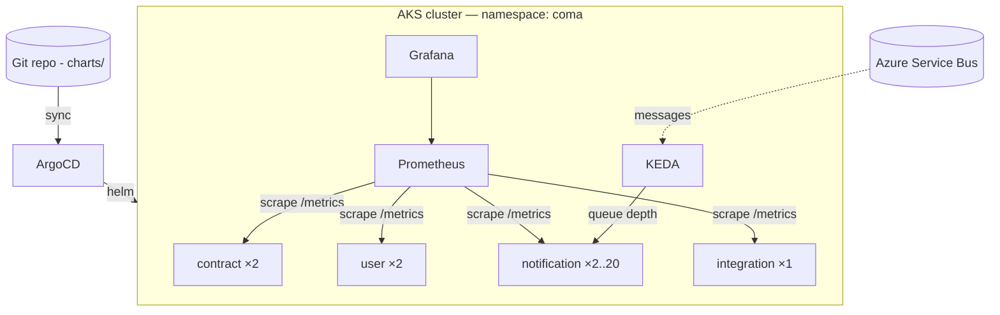

# Cloud-Native Microservices Platform on AKS

> The CoMa microservices (Contract · User · Notification · Integration) packaged for Kubernetes:
> a **Helm** chart, **GitOps** delivery via **ArgoCD**, event-driven autoscaling with **KEDA**,
> and **Prometheus + Grafana** observability. Runs on **Azure Kubernetes Service** — or locally on
> **kind** with one command.

<p align="center">
  
  
  
  
  
  
</p>

---

## What this demonstrates

Taking a real microservices design and running it the way a regulated enterprise does: declarative
infrastructure, Git as the single source of truth, autoscaling driven by real demand signals, and
metrics on every service. It's the operational half of the CoMa platform — the architecture this
author built at scale, now expressed as production Kubernetes.

| Concern | How |
|---------|-----|
| **Packaging** | One Helm chart renders all four services from a single image + values |
| **GitOps** | ArgoCD `Application` syncs the cluster to this repo (auto-prune, self-heal) |
| **Autoscaling** | KEDA scales Notification on Azure Service Bus queue depth; CPU HPA as fallback |
| **Observability** | Each service exposes `/metrics`; ServiceMonitors feed Prometheus; Grafana dashboard included |
| **CI** | GitHub Actions builds the image, lints + renders the chart, pushes to GHCR on `main` |
| **Health** | Liveness/readiness probes on `/health`; resource requests + limits |

---

## Architecture



Details, including the request/scale flow, in [docs/ARCHITECTURE.md](docs/ARCHITECTURE.md).

---

## Repository structure

```
aks-microservices-platform/
├── services/sample-service/     # Small .NET 10 service: /health + Prometheus /metrics
├── charts/platform/             # Helm chart deploying the 4 services (+ Service, HPA, ServiceMonitor)
├── gitops/argocd-application.yaml
├── keda/scaledobject-notification.yaml
├── observability/               # Prometheus values + Grafana dashboard
├── .github/workflows/ci.yaml    # Build image + helm lint/template + push
├── scripts/                     # kind-up.ps1 (local) · provision-aks.ps1 (Azure)
└── docs/                        # Architecture, deployment, debugging, ADRs
```

---

## Quick start (local, free — needs Docker Desktop running)

```powershell
./scripts/kind-up.ps1
```
This creates a kind cluster, builds + loads the service image, and `helm install`s the platform.
Then:
```powershell
kubectl get pods -n coma
kubectl -n coma port-forward svc/coma-contract 8080:80
curl http://localhost:8080/health    # and /metrics
```
Tear down: `kind delete cluster --name coma`.

### Validate the chart without a cluster
```powershell
helm lint charts/platform
helm template coma charts/platform        # renders 4 Deployments, 4 Services, 1 HPA, 4 ServiceMonitors
```

## Deploy to AKS
See [docs/DEPLOYMENT.md](docs/DEPLOYMENT.md) / `scripts/provision-aks.ps1` (provisions AKS + ACR,
installs ArgoCD + KEDA + Prometheus, deploys via GitOps). **Note:** a running AKS cluster bills hourly.

---

## Documentation
- [Architecture](docs/ARCHITECTURE.md) · [Deployment](docs/DEPLOYMENT.md) · [Debugging](docs/DEBUGGING.md) · [ADRs](docs/adr/)

## License
[MIT](LICENSE) © JobsDart. Uses open-source Helm, ArgoCD, KEDA and Prometheus (each under its own license).
