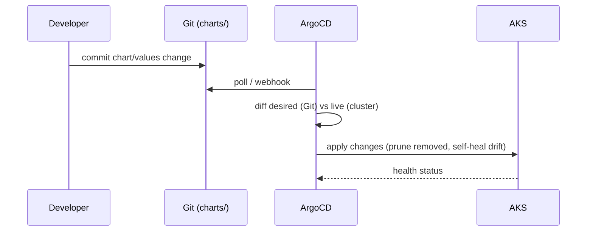
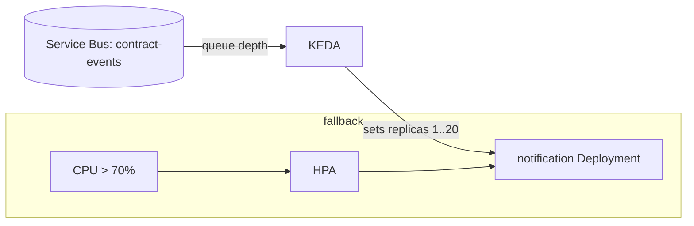

# Architecture

## Components

| Layer | What | Where |
|-------|------|-------|
| Workload | .NET 10 service, `/health` + Prometheus `/metrics` | `services/sample-service` |
| Packaging | Helm chart — Deployments, Services, HPA, ServiceMonitors from `values.yaml` | `charts/platform` |
| Delivery | ArgoCD `Application` (GitOps: auto-prune + self-heal) | `gitops/` |
| Autoscaling | KEDA `ScaledObject` (Azure Service Bus queue depth) + CPU HPA | `keda/`, chart |
| Observability | Prometheus scrapes `/metrics`; Grafana dashboard | `observability/` |
| CI | GitHub Actions: build image, `helm lint`, `helm template`, push | `.github/workflows` |

One container image runs as four logical services; the Helm chart loops over a `services` list in
`values.yaml`, setting `SERVICE_NAME` per Deployment. Adding a service is one list entry.

## GitOps flow

Git is the single source of truth. Manual `kubectl` changes are reverted by self-heal — exactly the
control a regulated environment needs (every change is a reviewed, auditable commit).

## Autoscaling

KEDA scales the Notification worker on **real demand** (messages waiting), scaling to near-zero when
idle — the right model for an event-driven worker, and a direct mapping of the CoMa Outbox/Service Bus
design. CPU-based HPA stays as a safety net. See [ADR-0002](adr/0002-keda-autoscaling.md).

## Why a single umbrella chart
See [ADR-0001](adr/0001-helm-umbrella-chart.md): one chart + a `services` list keeps the four services
consistent (probes, labels, resources, metrics) and makes the platform trivially extensible, at the
cost of per-service release independence (an acceptable trade for a cohesive platform).
